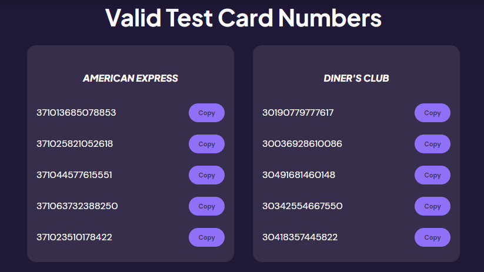

# Credit Card Checker

A fully-responsive website that utilizes Luhn's Algorithm (mod. 10) to determine if a credit card number is valid. It also compares the numbers with industry standards and displays information about the number itself. 

## Other Functionality

This tool also provides a documentation page within the site that explains how the algorithm works and what each industry identifier corresponds to.

## Tech Stack

**Website:** HTML, Sass, JavaScript.

**Tools:** Parcel, Vercel.

## Live Site

https://credit-card-checker-s1ue.vercel.app/

## Screenshots

#### Credit card validator (default state).

#### Credit card validator (valid card).

#### Credit card validator (invalid card).

#### Documentation page.

#### Fake Card numbers for testing.

#### Other Error States.

